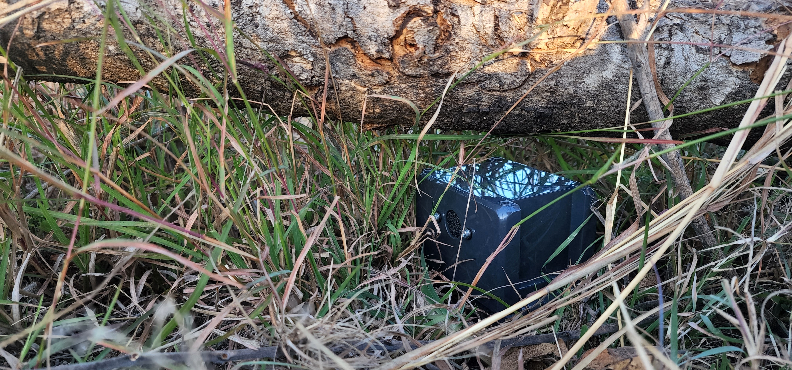
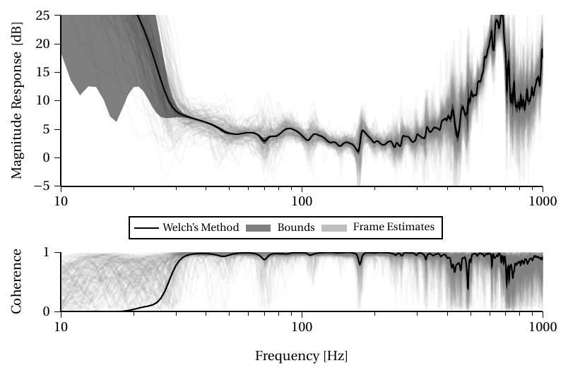

# TODO

- [ ] Add sample recordings

# Kleinvoet

[](https://ohwr.org/project/cernohl/wikis/Documents/CERN-OHL-version-2)
[](https://www.kicad.org)

*Kleinvoet* is a self-contained low-cost passive acoustic monitoring device.
The recorder was initially designed for distributed infrasonic (8Hz)
localisation, and features accurate temporal synchronisation through the use of
an onboard GNSS module.

The recorder is capable of 24-bit stereo recording at a variable sampling rate
of 8kHz to 192kHz.  The recordings along with timestamp and operational log
information is stored on a microSD card.  The recordings are stored as a series of
256MiB WAV files.



Firmware is available at [CMGeldenhuys/kleinvoet-firmware](https://github.com/CMGeldenhuys/kleinvoet-firmware).

## Example Recordings

- [Nearfield recording in a busy lab]()
- [5m away in studio enviroment]()
- [Farfield recording in outdoors]()

## SD Card Recommendations

In order to keep cost down, Kleinvoet does not make use of external SRAM. As such
the I/O buffer is limited to the internal SRAM of the MCU. It is thus
recommended using a class-10 high quality microSD card. Before a long-running
experiment it is also recommended to do a "low-level" format of the microSD
card. This will improve the write performance which is required at higher
sampling rates.
 
## Assembly

To assemble a Kleinvoet node, one will require all the electronic
components listed in the bill of materials (BOM), as well as have the necessary
PCBs manufactured. The provided gerber files can be sent directly to most PCB
fabrication houses. To assemble the boards, one can use either hot-air or plate
reflow soldering methods. The [interactive BOM](bom/ibom.html) might be useful
when placing the components manually.

| PCB | Back | Front |
| --- | --- | --- |
|Main Board|  |  |
|GNSS Board|  |  |
|Microphone Board|  |  |

Once all the components have been soldered to their respective boards, the
firmware can be flashed to the MCU using an [ST
Link](https://www.st.com/en/development-tools/st-link-v2.html)
debugger/programmer. However, not tested, any JTAG debugger/programmer should
work. There are also open-source projects that use another STM32 MCU as a
debugger/programmer ([blackmagic
probe](https://github.com/blackmagic-debug/blackmagic)).

Once programmed, proceed by connecting the GNSS header (marked on the respective
PCBs) of the main board to the GNSS daughter board. Note, this connector can be
reversed and the user should double-check that the **SYNC** pin (marked with an
triangle) on the main board is connected to the **SYNC** pin of the GNSS board.
If your use case does not require timestamping, the GNSS board can be omitted.
Next, connect the microphone boards to their respective channels, marked on the
main board's PCB as **CH1** and **CH2**. These connectors are keyed, and thus
It can only be connected one way.

If the user chooses to omit the weatherproof housing, Kleinvoet can be held
together with two rubber bands. The notches on the main and GNSS boards snap
together with the holes in the microphone boards to form a cube.


In order to assemble the weatherproof housing, start by placing the LiPo battery
in the lid of the enclosure. Thread the battery lead through the hole of the
main PCB adaptor plate. Next, mount the plate to the lid, keeping the battery in
place. One can then proceed to mount the main PCB to the adaptor. Next mount
the GNSS adaptor plate in the bottom of the Bocube housing, and mount the GNSS
PCB to the adaptor. If using the windshielding, remove the backing paper and
paste it firmly over the microphone inlets, (Note, the MEMS microphones used are
bottom port microphone and thus the inlet port is on the bottom side of the PCB.
The area to place the shielding foam is marked by a hashed circle) Install the
microphone board spacers, ensuring that the mounting holes align properly. The
microphone board assembly can now be mounted to the inside of the Bocube
housing. Next, connect the individual daughter boards (GNSS and microphone PCBs)
to their respective connectors on the main board.

Insert a FAT32 formatted microSD card into the main board and plug in the
battery. The node will perform a self test, followed by a self configuration
stage and then begin recordings. This process might take up to 10 seconds. Once
the node is configured, a solid amber light will be illuminated. Please refer to
the troubleshooting section if this is not the case.

## Operation

### Startup Procedure

1. Ensure the device is powered off.
1. Insert a FAT32 formatted microSD into the main board.
1. Connect the battery to the main board.
1. Wait for the solid amber indicator LED.
1. (Optional) Close weatherproof housing.

### Shutdown Procedure

1. Press the **USER** button (marked on the PCB of the main board).
1. The status indicators should start flashing repeatedly.
1. Disconnect the battery.
1. Remove microSD card.

### Status Indicators
Each PCB contains a *RED* status LED, used to indicate that the board has power.
On the main PCB there are two running status indication LEDs (*AMBER* and *BLUE*).

When **running**, the *AMBER* LED will remain solid. Once a GNSS lock (both time
and location) is obtained, the *BLUE* LED will pulse briefly every 10 seconds
(default).

If an unrecoverable error has occurred, the two status LEDs (*AMBER* and *BLUE*),
will pulse is quick succession. In this case, the watchdog timer will trigger and
attempt to write the operational log and reset the device. During a catastrophic
failure it might not be possible to write to the microSD card depending on the
error that has occurred.

| State | Blue LED | Amber LED |
| --- | --- | --- |
| Start-up | Blink (1s) | Off |
| Recording | Solid | X |
| GNSS Lock | X | Blink (10s) |
| Catastrophic Error | Strobe | Strobe |

In the table above, '*X*' denotes a "do not care" or irrelevant status. In other
words, it is not an indication of the current device state.

### File Layout

After recording, the following file structure will be present on the microSD card of the respective node.

```
(root)
├── REC_1
│   ├── KV.LOG
│   ├── REC.WAV
│   ├── REC.W01
│   ├── REC.W02
│   ├── REC.W03
│   └── TS.CSV
├── REC_X
│   ├── KV.LOG
│   ├── REC.WXX
│   └── TS.CSV
└── CONF.INI (experimental)
```

Each recording will be stored as a WAVE file in the corresponding `REC_X`
folder. Where the recorder increments `X` for every subsequent recording made on
the device (e.g. `REC_1`, `REC_2` etc.). Inside each recording folder are the
files associated with that recording. Due to the limitation of the FAT32
filesystem each individual recording has to be split up across multiple WAVE
files (e.g.`REC.WAV`, `REC.W01`, etc.). By default, this is in 256 MiB chunks, but
is user configurable Contained in the header of each WAVE file is timestamping
and location information required to synchronise the nodes during offline
processing of the files. A granular log of the timestamping metadata is stored
in `TS.CSV`. A complete operational log is stored in `KV.LOG`, which might deem
useful in troubleshooting a faulty recording node. (Experimental) Currently the
node's configuration is compiled into the device firmware, however, there is a
experimental firmware branch that allows for the configuration to be stored on
the microSD. 

| File/Folder | Purpose |
| --- | --- |
| REC_X | Folder containing all files associated with the particular recording|
| KV.LOG | Operational log of recordings |
| TS.CSV | Timestamping metadata |
| REC.WXX | Audio recording stored as a WAVE file |
| CONF.INI | (Experimental) Runtime configuration file |

## Power Spectral Density Estimates

Provided below are a power spectral density estimates (PSD) generated using
Welch's method. The [Sennheiser MKH 8020](https://sennheiser.com/mkh-8020) was used as a reference microphone and
tested in an acoustically dampened recording studio. These results provide an
estimate of the recording device's frequency response and should not be used
as ground truth measurements where spectral magnitude accuracy is required.
For those types of experiments, we recommenced the use of calibrated reference
sound amplitude measurement equipment.



## Troubleshooting

First ensure the following:
- Power from USB-C not battery, all boards have a solid *RED* LED illuminated
- MicroSD Card is formatted as **FAT32** and inserted
- The respective daughter boards are correctly connected

Enable `LOG_DEST_TTY` in `config.h`. The operational log will be printed in
real-time to the serial console available on the debug/programming port. When
using an *ST Link* debugger, this serial port can be opened using
[Putty](https://www.putty.org/) on Windows, or with the following command on
Linux:
``` sh
screen -b 115200 /dev/ttyACM0
```
The serial port is configured to **115200** baud rate and the standard **8N1**
configuration. Please see the [firmware guide](firmware/README.md) for more
information on setting up the programming environment on a Linux-based system.

## Future Hardware Revisions

- [ ] Dedicated GNSS connector, instead of headers
- [ ] E-Ink Display
- [ ] DFU mode (program without probe)
- [ ] Improved low-power mode (deep sleep)
- [ ] Add BME280 Sensor (temperature, humidity, atmospheric pressure)
- [ ] Battery charging status detection
- [ ] Dedicated power switch
- [ ] External RAM (larger buffer, allows use with low-end SD cards)
- [ ] Allow non-LiPo batteries (eg. alkaline)

## Contributing

We welcome contributions to the project. Unfortunately, hardware cannot be
provided to contributors. However, the [STM32
Nucleo-F446RE](https://www.st.com/en/evaluation-tools/nucleo-f446re.html) can be
used as an firmware development alternative, and is readily available.

## Authors and Acknowledgements

- [Christiaan M. Geldenhuys](https://github.com/CMGeldenhuys)
- [Thomas R. Niesler](https://dsp.sun.ac.za/~trn)

This project formed part of research done by the [Electrical and Electronic
Engineering Department](https://www.ee.sun.ac.za/) at Stellenbosch University.

[](https://www.ee.sun.ac.za/)

## License

The Kleinvoet project is licensed under the CERN Open Hardware License version 2
(strongly-reciprocal variant).
